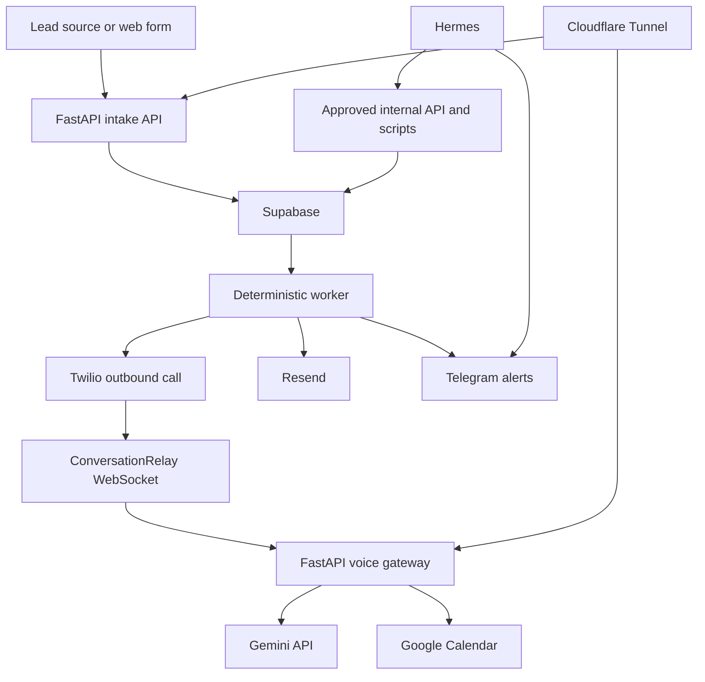

# Architecture

## Scope

The system is a production-ready AI voice lead qualification and appointment-booking platform for one business.

It receives consented leads, places outbound calls, conducts an approved qualification conversation, checks real Google Calendar availability, books confirmed appointments, sends confirmation emails, and alerts the owner when human action is required.

The initial release does not include:

* multi-tenant support;
* a customer-facing CRM dashboard;
* bulk outbound campaigns;
* Redis, Celery, Kubernetes, or a separate message broker;
* QuoteFollow-specific business logic.

The architecture keeps provider integrations and business rules isolated so that QuoteFollow can be added later without rewriting the voice gateway, background worker, or booking engine.

## High-Level Architecture



## Core Components

### FastAPI Application

FastAPI owns all public HTTP and WebSocket interfaces.

Responsibilities:

* receive leads from approved sources;
* validate and normalize lead data;
* verify consent and suppression status;
* create leads and durable jobs in Supabase;
* receive Twilio call-status webhooks;
* verify Twilio webhook signatures;
* accept verified ConversationRelay WebSocket connections;
* manage active call sessions;
* call Gemini during the live conversation;
* validate structured model decisions;
* check Google Calendar availability;
* create appointments idempotently;
* expose liveness and readiness endpoints.

FastAPI does not:

* poll background jobs continuously;
* perform scheduled retries;
* run stale-record recovery;
* poll Telegram;
* run backups or monitoring schedules;
* depend on Hermes during a live call.

### Deterministic Worker

The worker is a separate long-running Python process using the same application package as FastAPI.

Responsibilities:

* claim due jobs from Supabase;
* verify that a lead remains callable;
* create call-attempt records;
* initiate outbound Twilio calls;
* process bounded retries;
* send confirmation emails;
* send operational notifications;
* reconcile uncertain Twilio and calendar states;
* release expired job locks;
* move exhausted jobs to a failed state;
* recover stale call sessions after restarts.

The worker uses deterministic application rules. It does not use an LLM to decide whether a call, retry, booking, or email is permitted.

Supabase row locking and job leases prevent multiple workers from processing the same job.

### Hermes

Hermes is the owner-facing operational and administration layer.

Responsibilities:

* receive allowlisted Telegram commands;
* display failed-job and system-health summaries;
* notify the owner about bookings and escalations;
* run scheduled monitoring checks;
* invoke approved maintenance scripts;
* call authenticated internal administrative endpoints;
* assist with manual recovery and investigation.

Supported commands may include:

* pause calling;
* resume calling;
* show failed jobs;
* retry an approved lead;
* mark a lead for human follow-up;
* display recent booking results;
* run a health summary.

Hermes is not:

* the durable job queue;
* the primary retry engine;
* part of the live ConversationRelay loop;
* allowed to expose unrestricted shell or database access through customer input.

The core service continues operating temporarily if Hermes is unavailable.

### Supabase

Supabase PostgreSQL is the durable source of truth.

It stores:

* business configuration;
* leads and consent evidence;
* suppression records;
* lead event history;
* call attempts;
* active call sessions;
* appointments;
* background jobs;
* inbound provider events;
* idempotency keys.

Supabase Auth may later protect an owner-facing administration interface, but a web dashboard is not required for the first release.

### Twilio ConversationRelay

Twilio provides:

* the outbound telephone connection;
* call-status callbacks;
* speech recognition;
* text-to-speech;
* the real-time ConversationRelay WebSocket transport.

Twilio does not control qualification, booking, retry, consent, or suppression policy.

All Twilio HTTP and WebSocket requests must pass signature verification before changing business state.

### Gemini API

Gemini generates the next conversational response from:

* the approved system prompt;
* minimal lead context;
* the current conversation state;
* approved business qualification rules.

Gemini returns structured decisions such as:

* continue qualification;
* qualified;
* not qualified;
* request appointment slots;
* confirm selected slot;
* opt out;
* escalate to human;
* end call.

Application code validates every decision before performing an external action.

Gemini cannot directly:

* access credentials;
* write to Supabase;
* call Twilio;
* create calendar events;
* send email;
* invoke Hermes tools.

### Google Calendar

Google Calendar is the source of truth for availability and bookings.

The application:

1. queries genuine availability;
2. presents only valid slots;
3. receives explicit lead confirmation;
4. creates a local appointment with an idempotency key;
5. creates or finds the matching calendar event;
6. stores the Google event ID;
7. marks the appointment booked only after confirmation.

If a calendar request times out, the system reconciles by local appointment ID or calendar extended properties before retrying creation.

### Resend

Resend sends appointment confirmation emails after a calendar booking is confirmed.

Email delivery is processed by the deterministic worker.

Each confirmation uses an idempotency key based on the appointment ID so retries cannot send the same confirmation repeatedly.

### Telegram

Telegram is an owner notification and control channel.

It is not used for customer communication.

Commands are restricted by:

* allowed user IDs;
* allowed chat IDs;
* an explicit command allowlist;
* confirmation for high-impact actions;
* durable audit events.

## Lead-To-Booking Flow

1. A lead arrives through a form, API, or approved source adapter.
2. FastAPI validates the payload and normalizes the phone number.
3. FastAPI checks consent, suppression, and duplicate-source identifiers.
4. FastAPI creates the lead and a call job in one durable transaction.
5. The worker claims the job when calling rules allow.
6. The worker creates one call attempt and requests an outbound Twilio call.
7. Twilio calls the lead and connects ConversationRelay to FastAPI.
8. FastAPI verifies the Twilio WebSocket signature.
9. The agent introduces the business, discloses that it is automated, and explains the purpose.
10. Twilio sends recognized speech to FastAPI.
11. FastAPI sends approved context to Gemini.
12. Gemini returns response text and a structured decision.
13. FastAPI validates the decision and sends response text to Twilio.
14. If the lead opts out, suppression is recorded immediately and the call ends.
15. If human help is requested, the lead is marked for escalation and an alert job is created.
16. If the lead qualifies, FastAPI checks Google Calendar availability.
17. The lead confirms a real available slot.
18. FastAPI creates the appointment idempotently.
19. The worker sends the confirmation email.
20. The worker or Hermes sends the owner a Telegram summary.
21. Durable final state is stored in Supabase.

## Idempotency And Duplicate Prevention

Every external side effect requires a unique idempotency key.

Examples:

```text
lead:{source_system}:{source_entity_id}
call:{lead_id}:{attempt_number}
calendar:{lead_id}:{appointment_type}:{slot_start_utc}
email:{appointment_id}:confirmation
telegram:{event_type}:{entity_id}
```

Every inbound provider event is recorded before processing.

When a duplicate event is received:

* the request is acknowledged successfully;
* existing state is returned where appropriate;
* side effects are not executed again.

## QuoteFollow Compatibility

External source information is stored using generic fields:

```text
source_system
source_entity_type
source_entity_id
source_payload
source_payload_version
```

A future QuoteFollow integration may submit:

```text
source_system = quotefollow
source_entity_type = quote
source_entity_id = <quote identifier>
```

Business-specific rules remain behind:

* qualification configuration;
* appointment-type configuration;
* conversation templates;
* source adapters;
* notification templates.

The first release does not add quote tables, quote stages, multi-tenancy, or QuoteFollow-specific status values.

## Runtime And Deployment

The Oracle Cloud VM runs Docker Compose services for:

```text
api
worker
hermes
cloudflared
```

External ingress passes through Cloudflare Tunnel.

Public routes expose only:

* lead intake endpoints;
* required provider webhooks;
* the ConversationRelay WebSocket;
* health endpoints where appropriate.

Supabase, Gemini, Google Calendar, Resend, Telegram, and Twilio remain external managed services.

Secrets are loaded through environment variables and are never stored in source control, planning documents, or database configuration rows.

## Failure Principles

* Provider failures never produce false success.
* Calendar uncertainty never produces a booking promise.
* Retries are bounded.
* Jobs survive container and VM restarts.
* Opt-out and suppression override all pending call jobs.
* Active calls do not depend on Hermes.
* Customer input cannot access administrative tools.
* Critical state changes are persisted before dependent side effects.
* Recovery prefers reconciliation over blindly repeating an external action.
