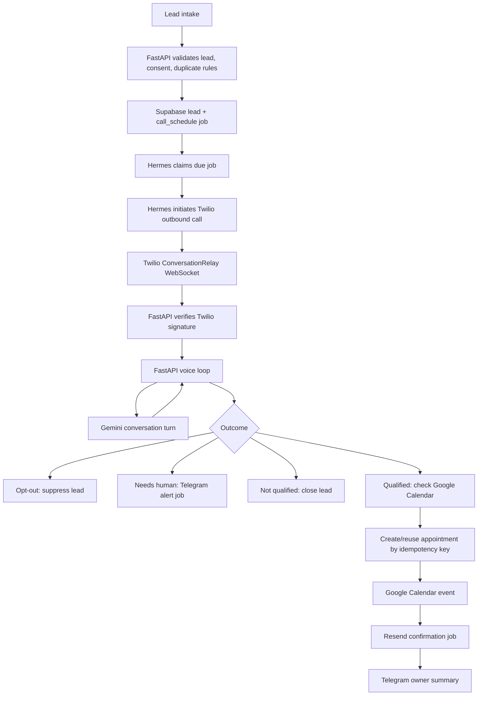

# Architecture

## Scope

This platform serves one business. It receives or imports consented leads, places outbound AI voice qualification calls, books appointments into Google Calendar when the lead qualifies, sends confirmations, and alerts the owner when human action is needed.

The design deliberately avoids a multi-tenant layer, separate queue service, Redis, Kubernetes, hosted observability stack, or web dashboard for the first production release.

The owner may later reuse the platform for the QuoteFollow project. To keep that path open, business-specific qualification criteria, appointment types, disclosure copy, lead payload fields, and message templates should stay configurable or isolated at clear boundaries. This is a portability constraint, not permission to build multi-tenant or QuoteFollow-specific functionality in the MVP.

## System Components

### FastAPI API And Voice Gateway

Responsibilities:
- Public HTTPS endpoints behind Cloudflare Tunnel.
- Twilio HTTP webhooks with signature verification.
- Twilio ConversationRelay WebSocket endpoint with handshake signature verification.
- Lead intake API for trusted sources.
- Owner/admin API protected by Supabase Auth if needed.
- Conversation session lifecycle for active calls.
- Low-latency Gemini turn calls during active voice sessions.
- Minimal synchronous persistence needed to reconstruct state after failure.

Non-responsibilities:
- Scheduled retries.
- Long-running recovery jobs.
- Telegram command polling.
- Bulk campaign orchestration.
- Calendar reconciliation outside the active booking action.

### Hermes Orchestration

Responsibilities:
- Claim due jobs from Supabase.
- Schedule outbound call attempts.
- Initiate Twilio outbound calls.
- Retry failed jobs with bounded backoff.
- Recover stale calls and stuck appointments.
- Send Telegram owner/admin alerts.
- Handle Telegram administrative commands.
- Run periodic reconciliation for Twilio, calendar, email, and job state.

Non-responsibilities:
- Real-time ConversationRelay WebSocket turn processing.
- Direct speech-to-text or text-to-speech.
- Runtime conversation generation.

### Supabase

Responsibilities:
- PostgreSQL source of truth.
- Authentication for owner/admin access.
- Persistent job state.
- Event deduplication.
- Lead, call, appointment, message, audit, and operational records.
- Row-level security for future admin UI where relevant.

Future portability note:
- Use generic core entities such as leads, call attempts, appointments, jobs, and provider events.
- Keep QuoteFollow-specific concepts, such as quote IDs, quote expiry, quote value, quote status, and quote follow-up stages, out of the core MVP unless a later stage explicitly scopes them.

### Twilio ConversationRelay

Responsibilities:
- Outbound phone call transport.
- Speech-to-text.
- Text-to-speech.
- ConversationRelay WebSocket messages.
- Call status callbacks.

### Gemini API

Responsibilities:
- Runtime conversation model.
- Lead qualification reasoning based on approved prompt, lead context, and current call transcript.
- Structured decision output for qualifying, disqualifying, booking, opt-out, or escalation.

### Google Calendar

Responsibilities:
- Source of truth for real availability.
- Appointment event creation.
- Appointment updates or cancellation if approved in later scope.

### Resend

Responsibilities:
- Confirmation emails after successful calendar booking.
- Optional owner operational email if Telegram fails.

### Telegram

Responsibilities:
- Owner alerts.
- Administrative commands such as pause calling, resume calling, retry lead, mark escalated, and show failed jobs.
- Human escalation notification and acknowledgement.

### Oracle Cloud VM, Docker Compose, Cloudflare Tunnel, GitHub Actions

Responsibilities:
- Oracle Cloud VM hosts containers.
- Docker Compose runs FastAPI, Hermes, Cloudflare Tunnel sidecar if chosen, and operational support containers if explicitly approved.
- Cloudflare Tunnel exposes HTTPS and secure WebSocket without opening broad inbound ports.
- GitHub Actions runs CI and, when approved, deployment checks.

## Complete Lead-To-Call-To-Booking Flow

1. Lead arrives through a trusted intake path.
2. FastAPI validates the request, normalizes the phone number, checks suppression and duplicate lead rules, and writes a `leads` record.
3. FastAPI records consent metadata and creates a `jobs` record for call scheduling if the lead is eligible.
4. Hermes claims the due call job.
5. Hermes confirms the lead is callable: consent present, not suppressed, within calling hours, attempts remaining, no active call.
6. Hermes creates a `call_attempts` record with an idempotency key and initiates the outbound Twilio call.
7. Twilio calls the lead and opens a ConversationRelay WebSocket to FastAPI.
8. FastAPI verifies the WebSocket handshake signature and maps the Twilio call SID to the `call_attempts` record.
9. FastAPI sends the required disclosure at the beginning of the AI call: the business identity, automated AI assistant nature where required, purpose, and opt-out/escalation path.
10. Twilio streams recognized text events to FastAPI over ConversationRelay.
11. FastAPI updates the in-memory call session, calls Gemini with the approved system prompt and minimal lead context, and sends the response text to Twilio for TTS.
12. FastAPI persists turn summaries, structured decisions, and critical state transitions without blocking the turn loop on slow noncritical writes.
13. If the lead opts out, FastAPI records suppression immediately, confirms no further calls, and ends the call.
14. If the lead needs a human, FastAPI marks the call as escalated and creates a Hermes alert job.
15. If the lead qualifies and wants an appointment, FastAPI checks real availability through Google Calendar before presenting slots.
16. The lead selects a slot.
17. FastAPI creates or reuses an `appointments` record with a booking idempotency key.
18. FastAPI creates the Google Calendar event using deterministic metadata and stores the provider event ID.
19. FastAPI marks the appointment booked only after calendar creation is confirmed or reconciled as already created.
20. FastAPI creates a Resend confirmation email job.
21. Hermes sends the confirmation email and records provider message ID.
22. Hermes sends the owner a Telegram summary.
23. Final lead status becomes `booked`, `not_qualified`, `opted_out`, `needs_human`, `unreachable`, or `failed` depending on outcome.

## Mermaid Flow

## WebSocket Loop Separation

The voice loop must remain small:
- Accept only verified Twilio WebSocket connections.
- Load the active call session.
- Process ConversationRelay events.
- Call Gemini for the next response or structured decision.
- Send response text back to Twilio.
- Persist critical call state and turn summaries.
- End the call when required.

The voice loop must not:
- Poll job queues.
- Retry unrelated failed jobs.
- Send Telegram admin responses.
- Run calendar reconciliation batches.
- Run backup, cleanup, or recovery jobs.
- Block on owner notification delivery.

Hermes runs those background responsibilities through Supabase jobs.

## Duplicate-Event Prevention

Every inbound provider event is normalized into `provider_events` before business logic is applied.

Rules:
- Use provider event ID when available.
- If no event ID exists, compute a deterministic hash from provider, event type, provider object ID, timestamp, and payload body hash.
- Enforce a unique constraint on `(provider, idempotency_key)`.
- Process event inside a transaction that inserts the dedupe record first.
- If insert conflicts, return a successful duplicate acknowledgement without re-running side effects.
- Store payload hash and first-seen/last-seen timestamps for audit.

## Webhook Signature Verification

Twilio:
- Validate `X-Twilio-Signature` on all HTTP webhooks using the configured Twilio auth token and the full externally visible URL.
- Validate `X-Twilio-Signature` in the initial ConversationRelay WebSocket handshake before accepting the connection.
- Reject invalid signatures with no side effects.
- Preserve the exact public URL and request parameters used for validation, accounting for Cloudflare Tunnel forwarding headers.

Telegram:
- Use bot token only from environment variables.
- If Telegram webhooks are used, validate the configured secret token header.
- If polling is used, restrict processing to allowlisted Telegram user IDs and chat IDs.

Resend:
- Verify webhook signatures if inbound delivery/bounce webhooks are enabled.

Supabase:
- Validate JWTs for owner/admin API routes.

Google:
- OAuth credentials and refresh tokens are secrets.
- Calendar callbacks are not required for MVP unless later approved.

## Retry, Timeout, And Failure Behavior

### Outbound Call Attempts

Initial policy:
- Maximum 3 attempts per callable lead.
- Attempts only during approved calling hours.
- Backoff starts at 2 hours, then next business day, configurable by owner policy.
- Stop immediately on opt-out, human escalation, booking, or explicit not interested.

Statuses:
- `scheduled`: waiting for Hermes.
- `dialing`: Twilio call requested.
- `ringing`: Twilio reports ringing.
- `in_progress`: ConversationRelay active.
- `completed`: call reached a terminal business outcome.
- `no_answer`: no answer before timeout.
- `busy`: recipient busy.
- `voicemail`: voicemail detected or inferred.
- `failed`: provider or platform failure.
- `timed_out`: call/session exceeded configured limit.
- `escalated`: human follow-up required.

### Voicemail

MVP default:
- Do not leave a marketing voicemail unless owner-approved script and consent basis are reviewed.
- Record `voicemail`.
- Schedule a retry if attempts remain and consent still allows.
- Escalate after final voicemail attempt if lead value warrants it.

### Busy

- Record `busy`.
- Retry after a short backoff within calling hours.
- Do not immediately redial more than once in the same day unless owner approves.

### No Answer

- Record `no_answer`.
- Retry in a later approved window.
- Mark `unreachable` after maximum attempts.

### Failed Call

- Provider errors, invalid phone number, Twilio rejection, and connection failures record `failed`.
- Retry only if failure is transient.
- Permanent number errors mark lead `invalid_phone`.
- Repeated platform failures create an owner alert.

### Timeout

- Conversation turn timeout: apologize once and retry the model call if safe.
- Repeated model timeout: end call politely and mark `needs_human` or `failed` depending on context.
- WebSocket idle timeout: close session, reconcile from Twilio status callback, and schedule recovery.
- Calendar timeout during booking: do not promise a booking; create recovery or human escalation.

### Human Escalation

Triggers:
- Lead asks for a human.
- Lead disputes consent.
- Lead asks legal, medical, financial, or sensitive questions outside approved scope.
- Model confidence is low for qualification or booking.
- Calendar booking fails after reconciliation.
- Angry or distressed lead.
- Complaint, opt-out ambiguity, or data deletion request.

Behavior:
- Stop automated persuasion.
- Confirm a human will follow up if appropriate.
- Create `human_escalations` and Telegram alert.
- Freeze further automated calls for that lead until owner action.

## Calendar Booking Idempotency

Booking idempotency key:
- `calendar_booking:{lead_id}:{appointment_type}:{slot_start_utc}:{slot_end_utc}`

Rules:
- Create a local `appointments` record in `booking_pending` with the idempotency key before calling Google Calendar.
- Unique constraint prevents duplicate local appointment attempts.
- Include the local appointment ID and idempotency key in Google Calendar event extended properties.
- If Google Calendar request times out, search by extended property before retrying creation.
- Mark booked only after an event ID is stored.
- Resend confirmation is keyed by appointment ID and sent only once.

## Logging And Redaction

Log:
- Request IDs, provider IDs, job IDs, call attempt IDs, appointment IDs, status transitions, latency, error categories, and retry counts.

Do not log:
- API keys, OAuth refresh tokens, bearer tokens, Twilio auth tokens, full webhook signatures, full phone numbers, full transcripts by default, payment details, or sensitive notes.

Redaction:
- Phone numbers displayed as E.164 last 4 digits only.
- Email addresses partially masked.
- Transcript storage configurable; default to summaries and structured facts unless the owner approves full transcripts.
- Prompt and model output logs must be scrubbed of secrets and unnecessary personal data.

## Metrics

Core metrics:
- Lead intake count.
- Callable leads.
- Calls attempted.
- Calls answered.
- No-answer, busy, voicemail, failed, and timed-out rates.
- Qualification rate.
- Booking rate.
- Opt-out rate.
- Human escalation rate.
- Duplicate webhook count.
- Provider API latency and error rate.
- Gemini turn latency and timeout rate.
- WebSocket session duration.
- Calendar conflict and booking failure rate.
- Email send success/failure.
- Job backlog, retry count, stale job count.

Alert thresholds:
- Twilio signature validation failures spike.
- Call failure rate exceeds threshold.
- Gemini timeout rate exceeds threshold.
- Calendar booking errors exceed threshold.
- Job backlog exceeds threshold.
- Duplicate events spike unexpectedly.
- Backup fails.
- Recovery job cannot repair stale records.

## Health Checks

FastAPI:
- `/health/live`: process is alive.
- `/health/ready`: database reachable, required env present, provider adapters configured for current environment.
- `/health/dependencies`: optional authenticated check of Twilio, Gemini, Google, Resend, Telegram readiness in staging/production.

Hermes:
- Heartbeat row updated each run.
- Job claim loop healthy.
- Recovery jobs completed within expected window.

Infrastructure:
- Docker container health checks.
- Cloudflare Tunnel status.
- VM disk, memory, CPU, and time sync.
- Supabase database backup status.

## Source References

- ICO PECR telephone marketing guidance: https://ico.org.uk/for-organisations/direct-marketing-and-privacy-and-electronic-communications/guide-to-pecr/electronic-and-telephone-marketing/telephone-marketing/
- ICO automated marketing call guidance: https://ico.org.uk/for-organisations/advice-for-small-organisations/direct-marketing-and-data-protection/marketing-and-data-protection-in-detail/
- Ofcom silent and abandoned calls reminder: https://www.ofcom.org.uk/phones-and-broadband/unwanted-calls-and-messages/refresher-messaging-on-silent-and-abandoned-calls
- Ofcom persistent misuse policy: https://www.ofcom.org.uk/phones-and-broadband/unwanted-calls-and-messages/persistent_misuse
- Twilio ConversationRelay onboarding and WebSocket signature validation: https://www.twilio.com/docs/voice/conversationrelay/onboarding
- Twilio webhook signature guidance: https://www.twilio.com/docs/usage/webhooks/getting-started-twilio-webhooks
